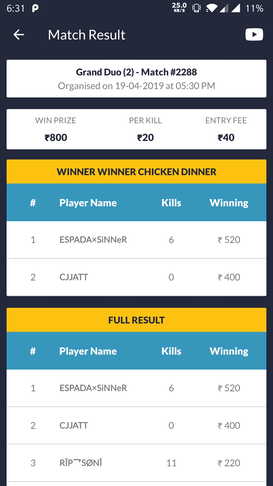

# Gaming Tournament App

An android app to help people organize mobile games.

- Used Material Design Library for layout design.
- Used Retrofit and Picasso for API interactions.
- Integrated Paytm Payment Gateway with the application.

Screenshots

|                                                  |                                                        |                                                  |
| :----------------------------------------------: | :----------------------------------------------------: | :----------------------------------------------: |
|  |       |  |
|     |  |  |
|   |   |   |
